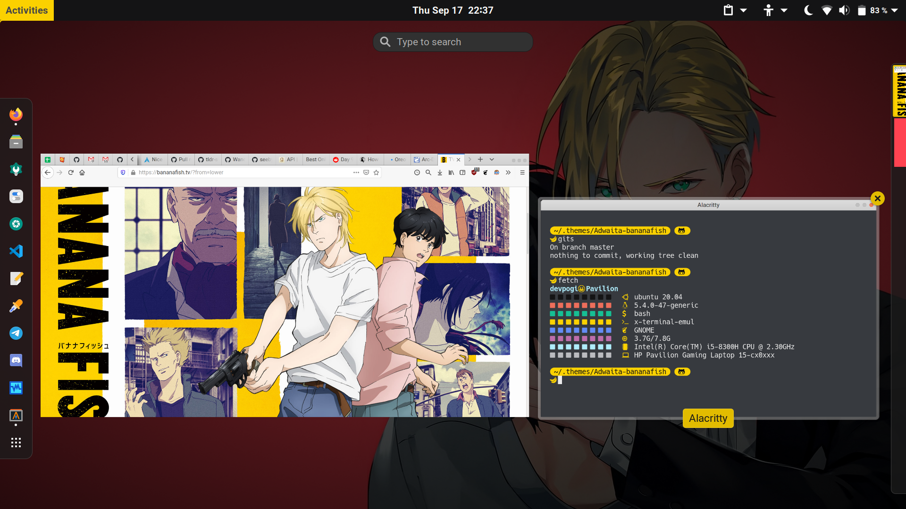
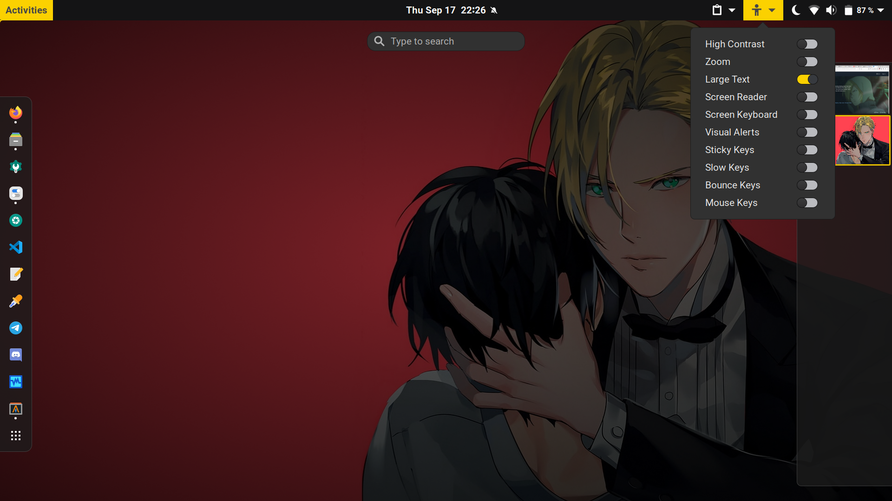

# Adwaita-bananafish gnome-shell-theme

A gnome-shell-theme inspired by the anime [Banana Fish](https://anilist.co/anime/100388/BANANA-FISH/).




## Installation

- Make directories `Adwaita-bananafish/gnome-shell/` in `~/.themes`

```bash
mkdir -p ~/.themes/Adwaita-bananafish/gnome-shell
```

- Copy `gnome-shell/gnome-shell.css` to `~/.themes/Adwaita-bananafish/gnome-shell/`

```bash
cp gnome-shell/gnome-shell.css ~/.themes/Adwaita-bananafish/gnome-shell/
```

- Select the shell theme from **gnome-tweaks** application.

## Tweaking: After making changes to the scss files, compile as follows - 

- *Followed directory structure of [Nordic](https://github.com/EliverLara/Nordic/tree/master/gnome-shell)*
- Use `gulp` to compile, in a similar way as [this, follow steps 1-4 except 3](https://medium.com/@jhinter/setting-up-gulp-to-compile-scss-in-less-than-5-minutes-fee8bea2b68b)
> `npm init`
> 
> `npm install gulp gulp-sass node-sass gulp-concat --save-dev`
- Use the provided `Gulpfile.js` for step 3 above.
> `npm run scss`

---

:pencil: NOTE: The gnome-shell-theme uses the base colors (from the 8 defined [here](https://github.com/devprabal/rice/tree/master/appearance/bananafish_color-scheme)), however, since it is built on Adwaita, some shades of them such as lighten, darken, transparentize, etc. are bound to exist. Nevertheless, they look good. :wink:
